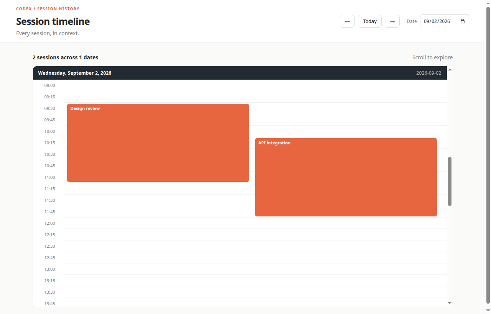

# Codex Session Timeline

Codex Session Timeline is a small, dependency-free web app for exploring Codex session history on a scrollable 24-hour timeline. Each session appears as a colored block, so overlapping work is easy to spot. The app reads local session data from `sessions.json`; it does not send session content to a server.



The screenshot uses fabricated data: “Design review” runs from 09:30–11:15 and “API integration” runs from 10:15–12:00.

## Run locally

Requirements: Python 3 and a local Codex session directory.

1. Generate the data file from your local sessions:

   ```bash
   python3 extract_sessions.py
   ```

2. Start a local web server from the project directory:

   ```bash
   python3 -m http.server 8000
   ```

3. Open [http://localhost:8000](http://localhost:8000).

The browser loads `sessions.json` with `fetch`, so opening `index.html` directly from the filesystem will not work in browsers that block local file requests.

## How it works

- `extract_sessions.py` scans the Codex session index and JSONL files, groups activity into sessions, and writes `sessions.json`.
- `index.html` defines the page structure and date controls.
- `app.js` groups sessions by date, calculates overlapping lanes, and renders the timeline.
- `style.css` provides the layout, colors, responsive behavior, and hover details.

Use the date field or the previous/next buttons to move between dates. Hover over a session block to see its title, start and end times, and duration.

## Notes

Session data can contain private conversation metadata. Keep `sessions.json` local and review the file before committing or publishing it. The repository ignores generated session data by default.
